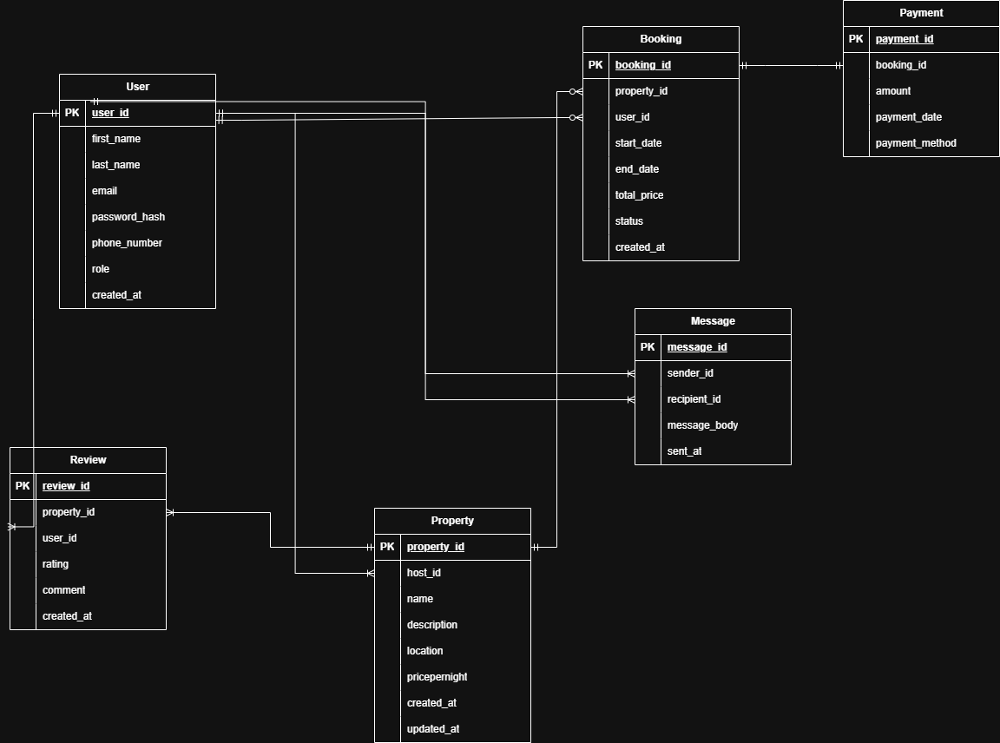

# Entities
Based on the provided specification, there are six primary entities.
  * **User:** Represents guests, hosts, and admins using the platform.
  * **Property:** Represents listing (e.g, house, apartment) available for rent.
  * **Booking:** Represents a specific reservation of a property by a user
  * **Payment:** Represents a payment transaction made for a booking.
  * **Review:** Represents a rating and comment left by a user for a property.
  * **Message:** Represents a message exchanged between two users.

### **User**
```
 Table User {
   user_id uuid [PK]
   first_name varchar [not null]
   last_name varchar [not null]
   email varchar [not null, unique]
   password_hash varchar [not null]
   phone_number varchar [null]
   role role [not null]
   created_at timestamp [default: `now()`]

  indexes {
     email 
   }
}

enum role {
 guest
 host
 admin
}
```
### **Property**
```
Table Property {
  property_id uuid [PK]
  host_id uuid [not null, ref: > User.user_id]
  name varchar [not null]
  description text [not null]
  location varchar [not null]
  pricepernight decimal [not null]
  created_at timestamp [default: `now()`]
  updated_at timestamp [note: 'ON UPDATE CURRENT_TIMESTAMP']
}
```

### **Booking**
```
Table Booking {
  booking_id uuid [PK]
  property_id uuid [not null, ref: > Property.property_id]
  user_id uuid [not null, ref: > User.user_id]
  start_date date [not null]
  end_date date [not null]
  total_price decimal [not null]
  status booking_status [not null]
  created_at timestamp [default: `now()`]

  indexes {
    property_id 
  }
}

enum booking_status {
  pending
  confirmed
  canceled
}
```
### **Payment**
```
Table Payment {
  payment_id uuid [PK]
  booking_id uuid [not null, ref: > Booking.booking_id]
  amount decimal [not null]
  payment_date timestamp [default: `now()`]
  payment_method payment_method_enum [not null]

  indexes {
    booking_id 
  }
}

enum payment_method_enum {
  credit_card
  paypal
  stripe
}
```
### **Review**
```
Table Review {
  review_id uuid [PK]
  property_id uuid [not null, ref: > Property.property_id]
  user_id uuid [not null, ref: > User.user_id]
  rating integer [not null, note: 'CHECK: rating >= 1 AND rating <= 5']
  comment text [not null]
  created_at timestamp [default: `now()`]
}
```
### **Message**
```
Table Message {
  message_id uuid [PK]
  sender_id uuid [not null, ref: > User.user_id]
  recipient_id uuid [not null, ref: > User.user_id]
  message_body text [not null]
  sent_at timestamp [default: `now()`]
}
```
## Entity Relationship (ER) Diagram

